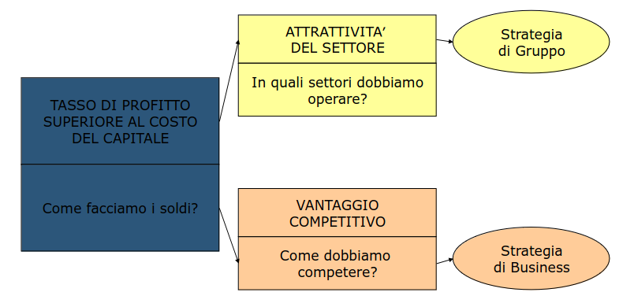
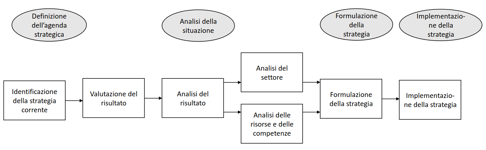

# Overview
## Programma
- Parte 1
    - Elementi introduttivi
    - L'analisi strategica
- Parte 2
    - L'analisi strategica
    -  Casi studio
- Parte 3
    - L'attuazione della strategia aziendale

# Parte 1
## Lezione 1
### Perchè le imprese hanno bisogno di strategia?
> La strategia migliora il processo decisionale in diversi modi

- Semplicifica il processo decisionale **vincolando il numero delle decisioni alternative da considerare** e operando come una regola euristica, cioè una regola generale che restringe l'indagine necessaria per ottenere una soluzione accettabile a un problema decisionale
- Non sempre la strategia funziona
    - Scelte sbagliate
    - Fattori esterni
    - Bias o pregiudizi

Processo di definizione della strategia -> Raggruppare conoscenze di diverse persone e di integrarle

### Esempi di strategie
- Tastiera QWERTY
    - Layout per rallentare la scrittura ed evitare incastri meccanici
- Blockbuster
    - Non ha saputo rinnovarsi ed è fallita

## Lezione 2
### Analisi SWOT
> SWOT: Strenghts, Weaknessess, Opportunities, Threats

- Analisi interna dei punti di Forza (S), e di quelli di debolezza (W)
- Analisi esterna di Opportunità (O) e Minacce (T)

In particolare:
1. Esame delle opportunità e delle dell'ambiente
    - Opportunità: Nuovi mercati, nuovi usi, nuove tecnologie
    - Minacce: Regolamentazione restrittiva, prodotti sostitutivi, nuovi concorrenti
2. Rilevazione dei punti di forza e di debolezza dell'impresa
3. Assegnazione dell'importanza ai fattori individuati
4. Confronto del posizionamento sugli elementi interni ed esterni
5. Individuaizone delle linee di azione

### Coerenza strategica
> Strategia significa creare una posizione unica e distintiva in grado di coinvolgere un insieme di attività (Michael E. Porter)

Una strategia deve essere coerente con le caratteristiche dell'ambiente esterno e interno all'azienda

Il concetto di *coerenza strategica* fa parte della **teoria delle contingenze**

### Studi sulle strategie d'impresa
- Strategia: Piano complessivo per lo spiegamento di risorse
    - Sono importanti
    - Implicano un significativo impiego di risorse
    - Non sono facilmente reversibili
- Tattica: Progetto di azione specifica

Non esiste una teoria generale della strategia, la cosa più vicina è la teoria dei giochi (Von Neumann)

Esistono svariate definizioni di strategia

### Strategia di gruppo e di business
- Corporate Strategy: scelta dei settori e mercati nel quale competere
- Business Strategy: volta a definire il modo di competere all'interno di un determinato settore o mercato

Lo scopo dell’analisi strategica non è fornire risposte, ma aiutarci a comprendere i problemi

### Strategia deliberata ed emergente
> Le strategie devono essere formulate in un processo iterativo che prevede sperimentazione e feedback

- Strategia deliberata: come viene concepita dai dirigenti (top-down)
- Strategia realizzata: la strategia effettivamente implementata (per Mintzberg rappresenta solo il 10-30% della strategia deliberata)
- Strategia emergente: decisioni che emergono dal processo in cui i singoli manager interpretano la strategia deliberata (bottom-up) e la adattano ai cambiamenti delle circostanze esterne

### Applicazione dell'analisi per la formulazione della strategia

